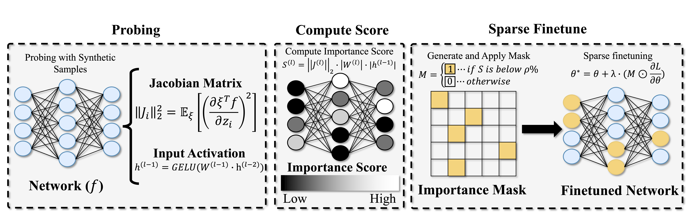

# Model-Dowser: Data-Free Importance Probing to Mitigate Catastrophic Forgetting in MLLMs - ICML 2026 🎉🎉




# Fine-tuning on Downstream Tasks
Note 1: our experiments reported in the paper are conducted on 8xNVIDIA A100 (40GB)

Note 2: "Synthetic Probing" is run only once and can be re-used for all downstream tasks

## LLaVA

### Prepare environment
1. Please clone (already available in this repo) and set up the environment following the offical repo here: [https://github.com/haotian-liu/LLaVA.git](https://github.com/haotian-liu/LLaVA.git)

You can prepare dataset similar to the format provided by LLaVA here: [https://github.com/haotian-liu/LLaVA/blob/main/docs/Data.md](https://github.com/haotian-liu/LLaVA/blob/main/docs/Data.md)

2. Move to LLaVA project:

```bash
cd LLaVA/
```

### Calculate weight importance score via "Synthetic Probing and Monte Carlo Estimation"

```bash
CUDA_VISIBLE_DEVICES=0 python scripts/llava_importance_self_gen_prompt.py \
    --model-id liuhaotian/llava-v1.5-7b \
    --model-name llava-v1.5-7b \
    --device cuda \
    --dtype bfloat16 \
    --llm-layers -1 \
    --include-lm-head \
    --K 64 --M 8 \
    --save-dir output/important-score/llava-v1.5-7b \
    --avoid-special \
    --prefix-min 1 \
    --prefix-max 5 \
    --batch-size 4 \
    --image-off
```

### Run LLaVA training with Model-Dowser

```bash
MASK_RATIO=0.1
TUNE_LAYER=20
CKPT=llava-v1.5-7b-dowser-full-ft-mask$MASK_RATIO-${TUNE_LAYER}layers

deepspeed --include localhost:0,1,2,3,4,5,6,7 llava/train/train_mem_dowser.py \
    --freeze_mm_mlp_adapter True \
    --freeze_backbone True \
    --tune_decoder_layer $TUNE_LAYER \
    --deepspeed ./scripts/zero3.json \
    --model_name_or_path liuhaotian/llava-v1.5-7b \
    --version v1 \
    --data_path <llava_format_annotation_json> \
    --image_folder <image_dir> \
    --vision_tower openai/clip-vit-large-patch14-336 \
    --mm_projector_type mlp2x_gelu \
    --mm_vision_select_layer -2 \
    --mm_use_im_start_end False \
    --mm_use_im_patch_token False \
    --image_aspect_ratio pad \
    --group_by_modality_length True \
    --bf16 True \
    --output_dir ./checkpoints/$CKPT \
    --num_train_epochs 5 \
    --per_device_train_batch_size 8 \
    --per_device_eval_batch_size 4 \
    --gradient_accumulation_steps 2 \
    --evaluation_strategy "no" \
    --save_strategy "no" \
    --save_steps 1000 \
    --save_total_limit 1 \
    --learning_rate 2e-5 \
    --weight_decay 0. \
    --warmup_ratio 0.03 \
    --lr_scheduler_type "cosine" \
    --logging_steps 1 \
    --tf32 True \
    --model_max_length 2048 \
    --gradient_checkpointing True \
    --dataloader_num_workers 4 \
    --lazy_preprocess True \
    --report_to wandb \
    --run_name $CKPT \
    --importance_dir ./output/important-score/llava-v1.5-7b \
    --train_low_importance_ratio $MASK_RATIO \
    --mask_targets "mlp,attn"
```

## NVILA

### Prepare environment
1. Please clone (already available in this repo) and set up the environment following the offical repo here: [https://github.com/NVlabs/VILA.git](https://github.com/NVlabs/VILA.git)

VILA provides a convenient way to set up the downstream dataset as follow: [https://github.com/NVlabs/VILA/tree/main/finetuning](https://github.com/NVlabs/VILA/tree/main/finetuning)

2. Move to VILA project:

```bash
cd VILA/
```

### Calculate weight importance score via "Synthetic Probing and Monte Carlo Estimation"

```bash
CUDA_VISIBLE_DEVICES=0 python scripts/importance_self_gen_prompt.py \
    --model-id Efficient-Large-Model/NVILA-Lite-2B \
    --model-name nvila-lite-2b \
    --device cuda \
    --dtype bfloat16 \
    --llm-layers -1 \
    --include-lm-head \
    --K 64 --M 8 \
    --save-dir output/important-score/nvila-lite-2b \
    --avoid-special \
    --prefix-min 1 \
    --prefix-max 5 \
    --batch-size 4 \
    --image-off
```

### Run NVILA training with Model-Dowser

```bash
DATA_MIXTURE=<dataset_name>
MASK_RATIO=0.1
TUNE_LAYER=20
CKPT=nvila-lite-2b-dowser-${DATA_MIXTURE}-full-ft-mask${MASK_RATIO}-${TUNE_LAYER}layers

deepspeed --include localhost:0,1,2,3,4,5,6,7 llava/train/train_mem_dowser.py \
    --deepspeed scripts/zero3.json \
    --model_name_or_path Efficient-Large-Model/NVILA-Lite-2B \
    --data_mixture $DATA_MIXTURE \
    --vision_tower Efficient-Large-Model/paligemma-siglip-so400m-patch14-448 \
    --mm_vision_select_feature cls_patch \
    --mm_projector mlp_downsample_3x3_fix \
    --tune_vision_tower False \
    --tune_mm_projector False \
    --tune_language_model True \
    --tune_decoder_layers $TUNE_LAYER \
    --mm_vision_select_layer -2 \
    --mm_use_im_start_end False \
    --mm_use_im_patch_token False \
    --image_aspect_ratio dynamic \
    --bf16 True \
    --output_dir checkpoints/$CKPT \
    --num_train_epochs 5 \
    --per_device_train_batch_size 8 \
    --gradient_accumulation_steps 2 \
    --evaluation_strategy no \
    --save_strategy no \
    --save_steps 1000 \
    --save_total_limit 1 \
    --learning_rate 2e-5 \
    --weight_decay 0. \
    --warmup_ratio 0.03 \
    --lr_scheduler_type cosine \
    --logging_steps 1 \
    --model_max_length 4096 \
    --gradient_checkpointing True \
    --dataloader_num_workers 16 \
    --vflan_no_system_prompt True \
    --report_to wandb \
    --run_name $CKPT \
    --importance_dir ./output/important-score/nvila-lite-2b \
    --train_low_importance_ratio $MASK_RATIO \
    --mask_targets "mlp,attn"
```

# Evaluation

## Downstream Tasks

We provide raw training and test annotations in [the data folder](./data/) of this repo. You may preprocess them according to the LLaVA format or NVILA format.
The images can be downloaded here:

- COCO-Caption: [https://cocodataset.org/#download](https://cocodataset.org/#download)
- Flickr30k: [https://shannon.cs.illinois.edu/DenotationGraph/](https://shannon.cs.illinois.edu/DenotationGraph/)
- IconQA: [https://github.com/lupantech/IconQA](https://github.com/lupantech/IconQA)
- ImageNet-R: [https://huggingface.co/datasets/HaiyangGuo/UCIT/tree/main/UCIT/ImageNet-R](https://huggingface.co/datasets/HaiyangGuo/UCIT/tree/main/UCIT/ImageNet-R)

The inference and evaluation scripts are provided in:
- LLaVA: [LLaVA/llava/eval/](./LLaVA/llava/eval/){task}
- VILA: [VILA/llava/eval/](./VILA/llava/eval/){task}

## Upstream/Zero-shot Evaluation

We follow the zero-shot evaluation from the original [LLaVA](https://github.com/haotian-liu/LLaVA.git) repo (TextVQA, MMBench-EN/CN, GQA) and the [LLaVA-HR](https://github.com/luogen1996/LLaVA-HR.git) repo (for OCRVQA and OKVQA). Please check these repos for the detailed evaluation.